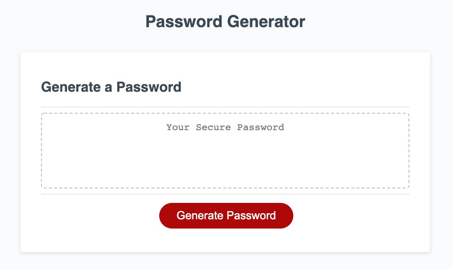

# week3-homework: Password Generator

# Description

This is an application that people can use to generate a random password based on criteria they have selected.
Firstly people will decide the length of the password they like (Must be between 8 and 128 characters).
Then they will choose if they want numbers, uppercase and lowercase letters and special characters in their password (at least one character type need to be selected).
After that the randomly generated password will be displayed on the page.

# Screenshots

The following image shows this Password Generator Application's appearance and functionality:

# Links

* The URLs of the deployed website: https://mengyue-z.github.io/week3-homework

* The URLs of the GitHub repositories: https://github.com/mengyue-z/week3-homework

